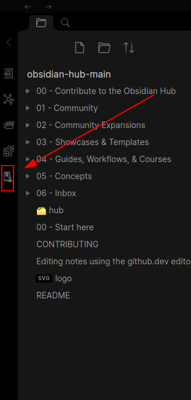
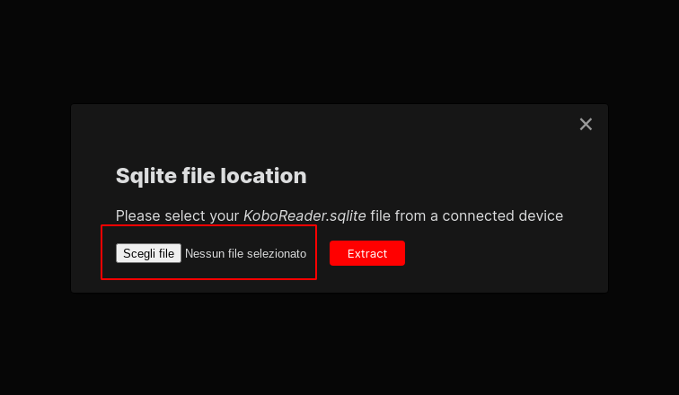
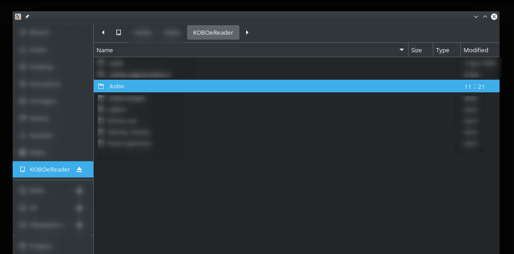
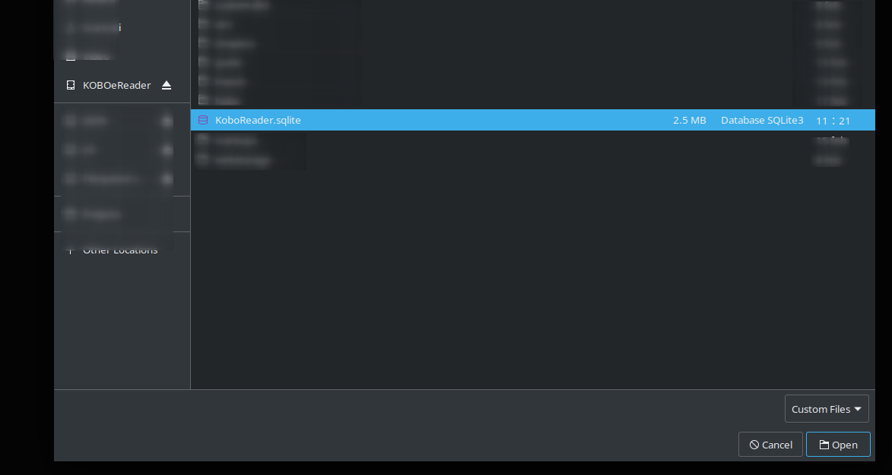

# Obsidian Kobo Highlight Importer

This plugin aims to make highlight import from Kobo devices easier.

- [Obsidian Kobo Highlight Importer](#obsidian-kobo-highlight-importer)
  - [How to use](#how-to-use)
  - [Templating](#templating)
    - [Examples](#examples)
    - [Variables](#variables)
  - [Helping Screenshots](#helping-screenshots)
  - [Contributing](#contributing)

## How to use

Once installed, the steps to import your highlights directly into the vault are:

1. Connect your Kobo device to PC using a proper USB cable
2. Check if it has mounted automatically, or mount it manually (e.g. open the root folder of your Kobo using a file manager)
3. Open the import window using the plugin button
4. Locate _KoboReader.sqlite_ in the _.kobo_ folder ( this folder is hidden, so if you don't see it you should enable hidden files view from system configs )
5. Extract

## Templating

The default template is:

```markdown
{{highlights}}
```

### Examples

```markdown
---
tags:
- books
---

{{highlights}}
```
### Variables

| Tag        | Description                                      | Example          |
|------------|--------------------------------------------------|------------------|
| highlights | Will get replaced with the extracted highlights. | `{{highlights}}` |

## Helping Screenshots





## Contributing

Please feel free to test, send feedbacks using Issues and open Pull Requests to improve the process. 
